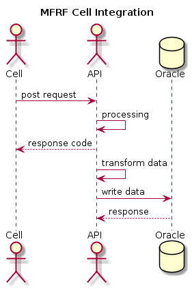

# Spec - MFRF API

## Overview

Mutual & Federal Risk Finance is a cell captive insurer who have a number of cells subscribed, approximately 40 at the moment and increasing. Each cell underwrites their own policies, handle claims and collect premiums on their own systems. MFRF are required by the regulator to get this data on a daily basis come next year January 2020.

## Sequence Diagram




## Functionality

To have the functionality for each Cell to be able to send data across to MFRF through an Application Programming Interface (API) via a post request. The API will handle data checking if mandatory fields are supplied, date fields are a date data type and write these records across to the database. There will be three endpoints, an endpoint for premiums, claims and customer information.

### Specification

#### Endpoints:

* <domain>/mfrf/premium
  * Post all premium information
  * Body - premium database schema (refer to database schemas below and json input)
	* Mandatory field validation
  * Date field validation
	* Write to MFRF premium table in Oracle

* <domain>/mfrf/claim
	* Post all claim information
		* Body - claim database schema (refer to database schemas below and json input)
		* Mandatory field validation
		* Date field validation
		* Write to MFRF claim table in Oracle
* <domain>/mfrf/customer
	* Post all customer information
		* Body - customer database schema (refer to database schemas below and json input)
		* Mandatory field validation
		* Date field validation
		* Write to MFRF customer table in Oracle

#### Database schemas:

* Premium
	* id int (auto increment)
	* cell_name varchar2(30)
	* data varchar2(4000)
	* processed_time timestamp
* Claim
	* id int (auto increment)
	* cell_name varchar2(30)
	* data varchar2(4000)
	* processed_time timestamp
* Customer
	* id int (auto increment)
	* cell_name varchar2(30)
	* data varchar2(4000)
	* processed_time timestamp

#### JSON Input:

###### Premium:
```
{
  "cust_no": "string",
  "pol_no": "string",
  "pr_trans_no": "int",
  "pr_trans_dt": "date",
  "pr_finmonth": "string",
  "pr_incept_dt": "date",
  "pr_cover_start": "date",
  "pr_cover_end": "date",
  "pr_renew_dt": "date",
  "pr_sam_class": "string",
  "pr_freq ": "char",
  "pr_sumin ": "int",
  "pr_city": "string",
  "pr_country": "string",
  "pr_post_code ": "string",
  "pr_curr": "string",
  "gross_ri_type": "string",
  "pr_trans_type": "string",
  "pr_amount": "float",
  "pr_amount_vat": "float",
  "pr_count": "int",
  "additional_fields": {
    "prod_name": "string",
    "pr_item_no": "string",
    "pr_item_desc": "string",
    "pr_extent": "string",
    "pr_cancel_dt": "date",
    "pr_cancel_reason": "string",
    "pr_limit ": "int",
    "pr_add": "string",
    "pr_add2": "string",
    "pr_suburb": "string",
    "pr_reason": "string",
    "pr_bordereaux": "string"
  }
}
```

###### Claim:
```
{
  "cust_no": "string",
  "pol_no": "string",
  "cm_clm_no ": "string",
  "cm_trans_no": "int",
  "cm_dom ": "date",
  "cm_finmonth": "string",
  "cm_lcc": "string",
  "cm_dol ": "date",
  "cm_dor ": "date",
  "cm_doc ": "date",
  "cm_reopen": "date",
  "cm_cat ": "string",
  "cm_curr": "string",
  "gross_ri_type": "string",
  "cm_trans_type": "string",
  "cm_amount": "float",
  "cm_amount_vat": "float",
  "cm_count": "int",
  "additional_fields": {
    "prod_name": "string",
    "pr_item_no": "string",
    "pr_item_desc": "string",
    "cm_status": "string",
    "cm_cat_type ": "string",
    "cm_bordereaux": "string",
    "cm_party_type": "string",
    "cm_party_name": "string"
  }
}
```

###### Customer:

```
{
  "cust_no": "string",
  "cus_type": "string",
  "cus_id_type": "string",
  "cus_id_num": "string",
  "cus_dob": "date",
  "cus_gender": "string",
  "cus_surname": "string",
  "cus_firstname": "string",
  "cus_reg_no": "string",
  "cus_vat_no": "int",
  "cus_reg_name": "string",
  "cus_area_code ": "string",
  "cus_contact_no1": "string",
  "cus_count": "int",
  "additional_fields": {
    "cus_seq_no": "int",
    "cus_title": "string",
    "cus_nationality": "string",
    "cus_marital": "string",
    "cus_language": "string",
    "cus_occupation": "string",
    "cus_postal_1": "string",
    "cus_postal_2": "string",
    "cus_postal_office": "string",
    "cus_postal_city": "string",
    "cus_postal_country": "string",
    "cus_post_code ": "string",
    "cus_physical_1": "string",
    "cus_physical_2": "string",
    "cus_physical_office": "string",
    "cus_physical_city": "string",
    "cus_physical_country": "string",
    "cus_email": "string",
    "cus_contact_no2": "int",
    "cus_cr_score_auth": "string",
    "cus_cr_score": "float",
    "cus_cr_rating": "string",
    "cus_rating_agency": "string"
  }
}
```

#### Authorization

A list of Cells will be provided who will require authorization to issue requests to the API where a token will be generated for each request made. From this token a username can be derived which will be used as the cell name for the database schema below.

#### Data Requirements and validation

* From the json input supplied above all mandatory fields are supplied in the outer dictionary and additional fields in supplied in the inner dictionary. When a post request is made all fields from the outer dictionary must be supplied, if any field is not supplied then the batch must be rejected with the appropriate HTTP status code.
  * * NB - In the nested part of the dictionary, where additional fields are supplied , the json input above is just a guideline as per our spec given to the cells. These fields are marked as optional to be supplied. In addition to this cells may supply other fields, which have not been noted here, that are on their system that they deem as informative.
* Every field in the outer dictionary (mandatory fields) that have a data type of date will need to be checked that a date object is supplied in the request. If this condition is not met the batch must be rejected with the appropriate HTTP status code

If all the above conditions are met the batch must be written to the appropriate table (taken from the endpoint the request was made to).

When inserting data into the database the API will have to generate the processed_time as per the database schema. This can be done at the SQL Insert statement provided below. As well as generate the Cell name taken from the authorization credentials.

#### Example SQL Statements

As the table schema for premium, claim and customer tables are the same, I have provided a generic insert example statement which the API will be responsible for generating.

```
INSERT INTO <table name> (id, cell_name, data, processed_time)
    VALUES (
        DEFAULT,
        'One Insure',
        '{
          "cust_no": "string",
          "pol_no": "string",
          "pr_trans_no": "int",
          "pr_trans_dt": "date",
          "pr_finmonth": "string",
          "pr_incept_dt": "date",
          "pr_cover_start": "date",
          "pr_cover_end": "date",
          "pr_renew_dt": "date",
          "pr_sam_class": "string",
          "pr_freq ": "char",
          "pr_sumin ": "int",
          "pr_city": "string",
          "pr_country": "string",
          "pr_post_code ": "string",
          "pr_curr": "string",
          "gross_ri_type": "string",
          "pr_trans_type": "string",
          "pr_amount": "float",
          "pr_amount_vat": "float",
          "pr_count": "int",
          "additional_fields": {
            "prod_name": "string",
            "pr_item_no": "string",
            "pr_item_desc": "string",
            "pr_extent": "string",
            "pr_cancel_dt": "date",
            "pr_cancel_reason": "string",
            "pr_limit ": "int",
            "pr_add": "string",
            "pr_add2": "string",
            "pr_suburb": "string",
            "pr_reason": "string",
            "pr_bordereaux": "string"
          }
        }',
        CURRENT_TIMESTAMP
    )
```

##### Comments

* id field will be generated by Oracle as this is a auto incremented primary key. Supplying the word DEFAULT will specify the default value for the column
* cell_name needs to be generated from the authorization token supplied to make the post request
* data will be generated from the body of the post request
* CURRENT_TIMESTAMP is the Oracle syntax to generate current timestamp
